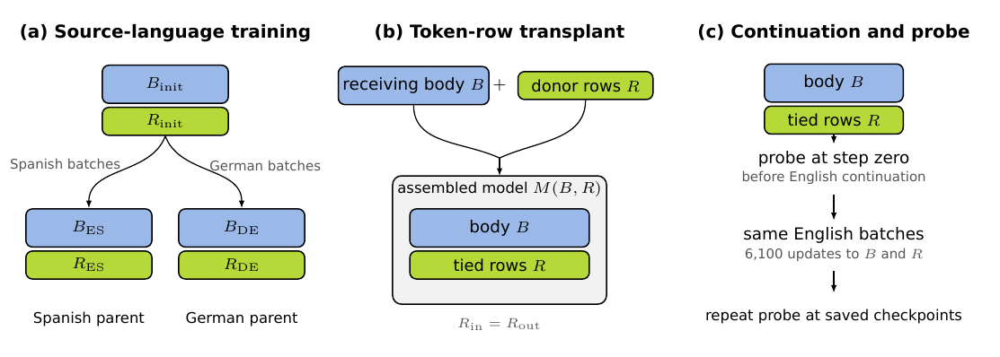

# Token Row Transplants

This repository accompanies *When Do Token Rows Transfer? Cross-Lingual
Token-Row Transplants in Transformer Language Models*, an MSc thesis in Machine
Learning and Data Science at Imperial College London.
The notebook rebuilds the figures and supporting summaries from the included
result tables.

[Method](docs/METHOD.md) ·
[Analysis notebook](notebooks/results_overview.ipynb) ·
[Results](results/README.md) ·
[Figures](figures/README.md) ·
[Reproducibility](docs/REPRODUCIBILITY.md)

The study asks whether a spelling-related pattern learned during Spanish or
German training survives when a model's tied token matrix is installed in
another transformer body. We measure the pattern as the relationship between
Spanish-English or German-English spelling similarity and English whole-word
surprisal. The tied matrix reads input tokens and scores output tokens. We
evaluate each assembled model before and during further training on English.



*The four main experiments share this basic sequence. Experiments 1-3 begin
from the same weights within each seed; Experiment 4 uses independently
initialized model families.*

## Findings

When the models began from the same weights, same-language rows produced the
strongest spelling effect. Rows from a separate same-language run preserved
nearly all of the co-trained effect. Reassigning the same vectors to different
token IDs weakened that effect. Copying rows unchanged between independently
initialized models did not give a consistent same-language advantage.

The model trained on English in both phases had the lowest English loss.

## Experiments

| Experiment | Question |
|---|---|
| [1. Training-language match](experiments/training_language_match/README.md) | Does the spelling effect depend on the training languages of the rows and body? |
| [2. Transfer across training runs](experiments/cross_run_transfer/README.md) | Do same-language rows transfer between runs that start from the same weights? |
| [3. Row-to-token assignment](experiments/row_to_token_assignment/README.md) | Does transfer require each vector to remain paired with its training-time token? |
| [4. Independent initialization](experiments/independent_initialization/README.md) | Does unchanged copying work between models that start from different weights? |
| [Larger-decoder check](experiments/larger_decoder_assignment/README.md) | Does the assignment result also appear at step zero in one larger configuration? |

## Experimental setup

The four main experiments use a tied eight-layer decoder with width 384, six
attention heads, and a context length of 256. One 16,384-ID byte-level BPE
tokenizer keeps token identities fixed across Spanish, German, and English.
Parent training and English continuation each last 6,100 updates, and compared
conditions receive the same English batches within a seed or initialization
pair. Each main experiment uses twelve seeds or initialization pairs.

Model training and held-out evaluation use separate Wikipedia text. The probe
contains 6,023 English words from the British Council's BEA 2026 Knowledge-based
Vocabulary Lists. It compares Spanish-English and German-English spelling
similarity with English whole-word surprisal. The main outcomes measure the
spelling effect immediately after row installation and across English
continuation. The larger-decoder check repeats the step-zero assignment
comparison in one 12-layer configuration.

## Verify the figures and notebook

From the repository root, use GNU Make and the Python version in
`.python-version`:

```bash
make environment
source .venv/bin/activate
make verify-results
```

`make verify-results` renders the figures in a temporary directory, compares
them with the committed copies, and executes a fresh copy of the notebook.
`make check` also runs the tests, lint, type checking, and formatting checks.
Training the models again requires source data and checkpoints that are not
distributed with this repository.

## Repository contents

- [`experiments/`](experiments/) describes each comparison and its configuration.
- [`src/token_row_transplants/`](src/token_row_transplants/) contains the model,
  transplant, analysis, and plotting code.
- [`results/`](results/) contains the compact tables used by the notebook.
- [`figures/`](figures/README.md) contains the experiment overview and analysis
  figures.
- [`notebooks/results_overview.ipynb`](notebooks/results_overview.ipynb) contains
  the plots and supporting analysis.

## Data availability

The repository does not redistribute the source corpora, KVL-derived feature
tables, composite probe, pretokenized streams, or model checkpoints.
[`DATA_LICENSE.md`](DATA_LICENSE.md) records attribution and the redistribution
boundary. The [reproducibility guide](docs/REPRODUCIBILITY.md) lists the included
analysis files and the inputs needed to repeat model training.

## Citation and license

Use [`CITATION.cff`](CITATION.cff) to cite this repository. Project-authored
code, documentation, and figures are available under the [`MIT License`](LICENSE).
Research inputs retain their upstream terms.
